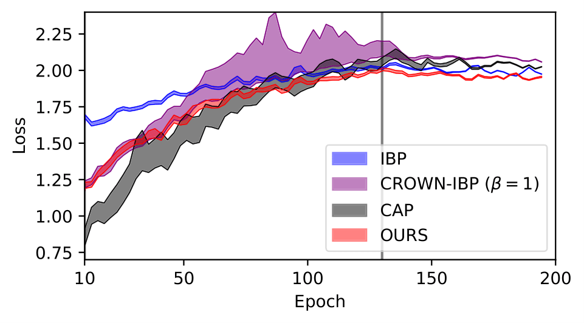

# Towards Better Understanding of Training Certifiably Robust Models against Adversarial Examples

This repository is the official implementation of "Towards Better Understanding of Training Certifiably Robust Models against Adversarial Examples".

This repository is modified from the CROWN-IBP repository (https://github.com/huanzhang12/CROWN-IBP).



(&#8593;) IBP starts with a higher loss but ends with a relatively lower loss, demonstrating smaller loss variations (colored area). Our method uses tight bounds like CROWN-IBP (β=1), while its landscape is as favorable as IBP, achieving the best performance among these four methods.

<!----
> 📋Optional: include a graphic explaining your approach/main result, bibtex entry, link to demos, blog posts and tutorials
---->

## Requirements

It requires torch version>=1.3.0.


To install requirements:

```setup
conda env create -f environment.yml
```

<!----
> 📋Describe how to set up the environment, e.g. pip/conda/docker commands, download datasets, etc...
---->

## Training (and Evaluation)

To train and evaluate the model(s) in the paper, run this command:

```train
python train.py --config config/cifar10.json 
python train.py --config config/cifar10.json "training_params:epsilon=0.007843" "training_params:train_epsilon=0.007843" 
python train.py --config config/mnist.json
python train.py --config config/svhn.json


python eval.py --config config/cifar10.json "eval_params:model_paths=cifar_medium_8px"
python eval.py --config config/cifar10.json "eval_params:model_paths=cifar_medium_2px" "eval_params:epsilon=0.007843"
python eval.py --config config/mnist.json "eval_params:model_paths=mnist_large_train04"
python eval.py --config config/svhn.json "eval_params:model_paths=svhn_large_001"


```

<!----
> 📋Describe how to train the models, with example commands on how to train the models in your paper, including the full training procedure and appropriate hyperparameters.
---->
